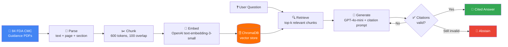

<div align="center">

# 📋 FDA GuidanceRAG

### Ask FDA regulatory guidance documents a question. Get a cited answer — or an honest "I don't know."

[](https://www.python.org/)
[](https://www.langchain.com/)
[](https://www.langchain.com/langgraph)
[](https://openai.com/)
[](https://www.trychroma.com/)
[](https://streamlit.io/)
[](#license)

</div>

---

## 🧠 What is this, in plain English?

Imagine handing an assistant a filing cabinet full of dense FDA regulatory documents — hundreds of pages about drug manufacturing, quality control, and CFR rules — and then just **asking it questions out loud**.

> *"What documentation is required for CMC postapproval manufacturing changes?"*

Instead of reading 80 pages yourself, **FDA GuidanceRAG** searches the right document, reads the relevant part, and answers you directly — with a footnote showing exactly which document and page it got that answer from. If it can't find a real answer, it says so instead of guessing.

This is what's called a **RAG system** (Retrieval-Augmented Generation) — the same underlying idea behind tools like ChatGPT, but restricted to only answer from a specific, trusted set of documents, with receipts for every claim it makes.

<div align="center">

➡️

➡️

➡️

</div>

---

## ⚙️ What is this, technically?

A domain-specific "Ask My Docs" application over FDA CMC (Chemistry, Manufacturing, and Controls) guidance documents, built with:

- **Hybrid-ready retrieval** — currently dense vector search (OpenAI embeddings + Chroma), architected to add BM25 keyword search + cross-encoder reranking
- **Citation-enforced generation** — every factual claim must cite a specific retrieved chunk, verified by a strict validator (not just prompted and hoped for)
- **Abstention on low-confidence answers** — if the retrieved context doesn't support an answer, the system says so instead of hallucinating
- **Retry logic** — a LangGraph state machine retries generation once if citations fail validation, before falling back to abstention
- **A working UI** — Streamlit app with expandable, clickable sources and per-query latency/token metrics

---

## 🏗️ Architecture



---

## 📊 Project Status

| Stage | Status | Details |
|---|---|---|
| Corpus collection | ✅ Done | 84 FDA CMC guidance PDFs, validated text layers |
| Parsing | ✅ Done | 1,571 pages → page numbers + section headings extracted |
| Chunking | ✅ Done | 2,196 chunks (600 tokens, 100-token overlap) |
| Embedding + vector store | ✅ Done | All chunks embedded, stored in ChromaDB |
| Vector retriever | ✅ Done | Implements shared `Retriever` protocol |
| Prompt + citation enforcement | ✅ Done | Per-sentence/bullet citation requirement |
| LangGraph pipeline | ✅ Done | retrieve → generate → validate → retry → abstain |
| Citation validator | ✅ Done | Strict per-claim + range checking |
| Streamlit UI | ✅ Done | Working end-to-end demo |
| BM25 + hybrid retrieval | ⬜ Next | Keyword search to complement vector search |
| Cross-encoder reranking | ⬜ Next | Rerank top candidates for precision |
| Golden evaluation set | ⬜ Next | 80 hand-verified Q&A pairs |
| Ragas + deterministic eval | ⬜ Planned | Recall@5, faithfulness, abstention precision/recall |
| CI gating | ⬜ Planned | GitHub Actions blocks regressions automatically |
| Failure analysis + full README | ⬜ Planned | Root-cause breakdown of worst-performing queries |

---

## 🔎 A real finding from testing

While testing retrieval quality, we discovered our corpus contains **41 citations of ICH Q7** (a well-known FDA guidance) inside other documents — but not the ICH Q7 document itself. Pure vector search consistently missed exact-term queries like *"ICH Q7"* in favor of semantically similar (but wrong) content.

This is a textbook illustration of *why hybrid search exists*: keyword search (BM25) reliably catches exact terms like citation numbers and CFR references that meaning-based vector search can miss. It's currently the top motivator for the next phase of this project.

---

## 🚀 Quick Start

```bash
# Clone and set up
git clone https://github.com/Prashasti9/FDA_GuidanceRAG.git
cd FDA_GuidanceRAG
python3.11 -m venv venv
source venv/bin/activate
pip install -r requirements.txt

# Add your OpenAI API key
echo "OPENAI_API_KEY=your_key_here" > .env

# Run the full pipeline (if starting from scratch)
python -m ingest.parse
python -m ingest.chunk
python -m ingest.embed

# Launch the app
streamlit run app.py
```

---

## 📁 Project Structure

```
FDA_GuidanceRAG/
├── corpus/                  # 84 raw FDA CMC guidance PDFs
├── data/
│   ├── parsed.jsonl         # extracted text + page + section per page
│   ├── chunks.jsonl         # 600-token chunks with metadata
│   └── chroma/              # vector store
├── ingest/
│   ├── parse.py             # PDF → structured text
│   ├── chunk.py             # text → token-based chunks
│   └── embed.py             # chunks → embeddings → Chroma
├── src/
│   ├── contracts.py          # shared Chunk / Answer / Retriever definitions
│   ├── vector_retriever.py   # dense vector retrieval
│   ├── citation_validator.py # strict citation checking
│   └── pipeline.py           # LangGraph: retrieve → generate → validate
├── prompts/
│   └── answer_v1.yaml        # citation-enforcing prompt template
├── app.py                     # Streamlit UI
└── PROGRESS.md                 # running project log
```

---

## 🎬 Demo Video

*A 2-minute walkthrough is coming soon — see the suggested script in [`docs/demo-script.md`](docs/demo-script.md).*

---

## 🛠️ Tech Stack

| Layer | Tool |
|---|---|
| Orchestration | LangGraph |
| Embeddings | OpenAI `text-embedding-3-small` |
| Generation | OpenAI `gpt-4o-mini` |
| Vector store | ChromaDB |
| PDF parsing | PyMuPDF |
| UI | Streamlit |
| CI/testing (planned) | GitHub Actions, Ragas |

---

## 📄 License

MIT — see [LICENSE](LICENSE) for details.

---

<div align="center">
Built as a portfolio project to demonstrate production-grade RAG patterns:<br/>
hybrid retrieval, citation enforcement, abstention, and CI-gated evaluation.
</div>
